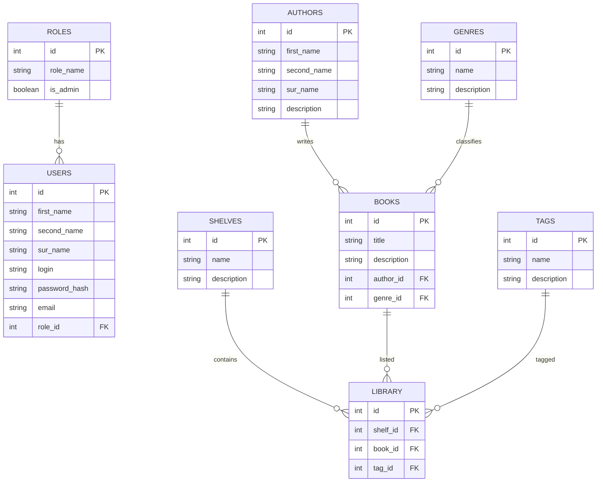

```mermaid
erDiagram
    ROLES ||--o{ USERS : has

    AUTHORS ||--o{ BOOKS : writes
    GENRES  ||--o{ BOOKS : classifies

    SHELVES ||--o{ LIBRARY : contains
    BOOKS   ||--o{ LIBRARY : listed
    TAGS    ||--o{ LIBRARY : tagged

    ROLES {
        int id PK
        string role_name
        boolean is_admin
    }

    USERS {
        int id PK
        string first_name
        string second_name
        string sur_name
        string login
        string password_hash
        string email
        int role_id FK
    }

    AUTHORS {
        int id PK
        string first_name
        string second_name
        string sur_name
        string description
    }

    GENRES {
        int id PK
        string name
        string description
    }

    BOOKS {
        int id PK
        string title
        string description
        int author_id FK
        int genre_id FK
    }

    SHELVES {
        int id PK
        string name
        string description
    }

    TAGS {
        int id PK
        string name
        string description
    }

    LIBRARY {
        int id PK
        int shelf_id FK
        int book_id FK
        int tag_id FK
    }
```