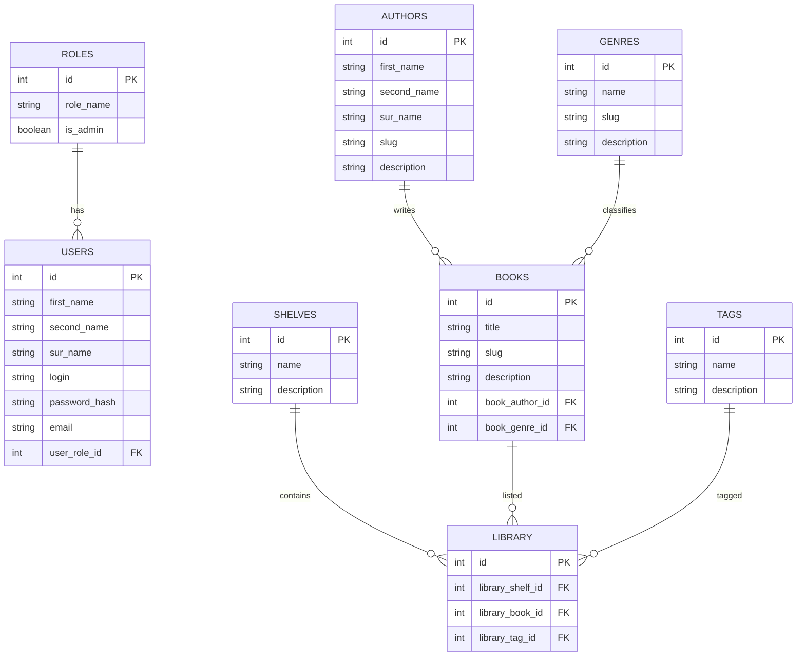

# Database v0.1

This describes the active v0.1 schema used by local SQLite development and PostgreSQL stage/prod environments.

Source files:
- `db/sqlite/schema_v0_1.sql`
- `db/sqlite/seed.sql`
- `db/sqlite/reset-dev-db.sh`
- `db/postgresql/schema_v0_1.sql`
- `db/postgresql/seed.sql`

## Current Approach

- SQLite is the active local development database.
- PostgreSQL is used for `APP_ENV=stage` and `APP_ENV=prod`.
- The v0.1 book repository behavior is implemented for both SQLite and PostgreSQL.
- There is no migration system yet.
- Local reset recreates the database from schema and seed SQL.

Reset command:

```bash
make db/reset
```

Default local database path:

```text
./data/book_social_dev.db
```

Manual PostgreSQL initialization:

```bash
psql "$APP_DB_DSN" -f db/postgresql/schema_v0_1.sql
psql "$APP_DB_DSN" -f db/postgresql/seed.sql
```

## Tables

### roles

- `id`
- `role_name`
- `is_admin`

### users

- `id`
- `first_name`
- `second_name`
- `sur_name`
- `login`
- `password_hash`
- `email`
- `user_role_id`

### authors

- `id`
- `first_name`
- `second_name`
- `sur_name`
- `slug`
- `description`

### genres

- `id`
- `name`
- `slug`
- `description`

### books

v0.1 assumes one author and one genre per book.

- `id`
- `title`
- `slug`
- `description`
- `book_author_id`
- `book_genre_id`

### shelves

- `id`
- `name`
- `description`

### tags

- `id`
- `name`
- `description`

### library

Represents a book on a shelf, optionally with one tag.

- `id`
- `library_shelf_id`
- `library_book_id`
- `library_tag_id`

## Current Catalog Queries

The active catalog repository joins:

```text
books.book_author_id -> authors.id
books.book_genre_id  -> genres.id
```

Catalog filtering uses:

```text
authors.slug
genres.slug
books.slug
```

## ERD


