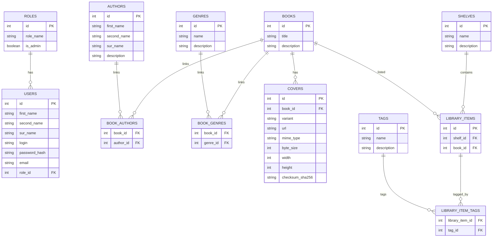

```mermaid
erDiagram
    ROLES ||--o{ USERS : has

    BOOKS ||--o{ BOOK_AUTHORS : links
    AUTHORS ||--o{ BOOK_AUTHORS : links

    BOOKS ||--o{ BOOK_GENRES : links
    GENRES ||--o{ BOOK_GENRES : links

    BOOKS ||--o{ COVERS : has

    SHELVES ||--o{ LIBRARY_ITEMS : contains
    BOOKS   ||--o{ LIBRARY_ITEMS : listed

    LIBRARY_ITEMS ||--o{ LIBRARY_ITEM_TAGS : tagged_by
    TAGS          ||--o{ LIBRARY_ITEM_TAGS : tags

    ROLES {
        int id PK
        string role_name
        boolean is_admin
    }

    USERS {
        int id PK
        string first_name
        string second_name
        string sur_name
        string login
        string password_hash
        string email
        int role_id FK
    }

    AUTHORS {
        int id PK
        string first_name
        string second_name
        string sur_name
        string description
    }

    GENRES {
        int id PK
        string name
        string description
    }

    BOOKS {
        int id PK
        string title
        string description
    }

    BOOK_AUTHORS {
        int book_id FK
        int author_id FK
    }

    BOOK_GENRES {
        int book_id FK
        int genre_id FK
    }

    COVERS {
        int id PK
        int book_id FK
        string variant
        string url
        string mime_type
        int byte_size
        int width
        int height
        string checksum_sha256
    }

    SHELVES {
        int id PK
        string name
        string description
    }

    TAGS {
        int id PK
        string name
        string description
    }

    LIBRARY_ITEMS {
        int id PK
        int shelf_id FK
        int book_id FK
    }

    LIBRARY_ITEM_TAGS {
        int library_item_id FK
        int tag_id FK
    }
```