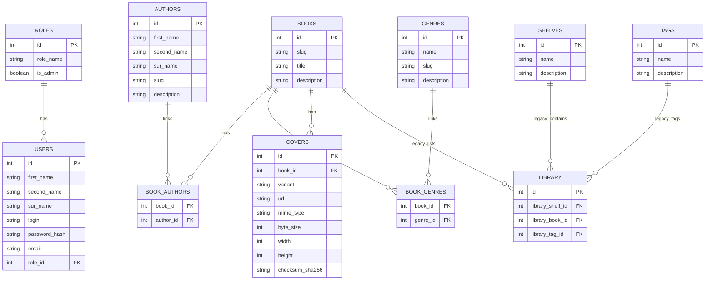

# Database v0.2

Migration `000002_normalize_catalog` creates this schema after the v0.1 baseline migration.
The database/bootstrap path is v0.2, while application read repositories remain v0.1-shaped until
the dependent v0.2.3 branch.

Main changes from v0.1:

- books/authors become many-to-many
- books/genres become many-to-many
- covers store URL metadata
- legacy `library`, `shelves`, and `tags` remain preserved as demo/legacy structures
- the final user `library_items` model is deferred to v0.3

Slugs should remain part of catalog entities because current routes use book, author, and genre slugs.

The catalog migration does not create `library_items` or `library_item_tags`. Those tables require
user identity, reading status, privacy, and lifecycle rules that belong to the later personal
library work.

## Slugs and covers

`books.slug`, `authors.slug`, and `genres.slug` remain unique within their entity type and are
treated as stable public identifiers. A slug change requires a later redirect/compatibility
decision. Covers store only external URL and technical metadata; file upload and media storage are
out of scope.
