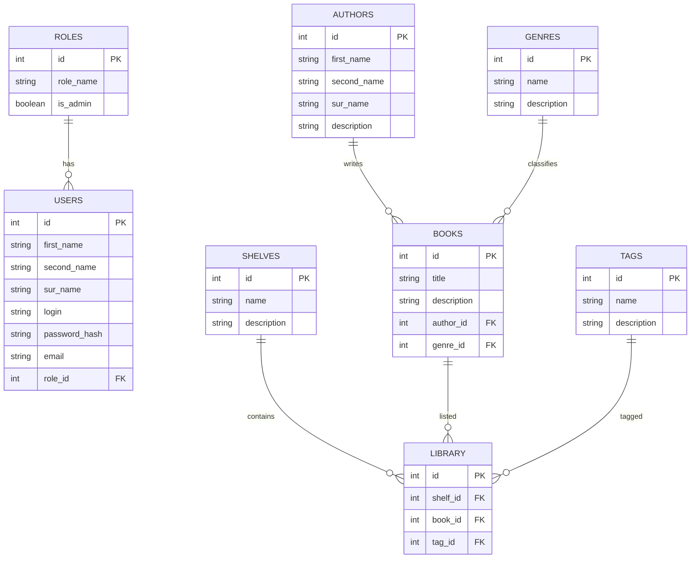
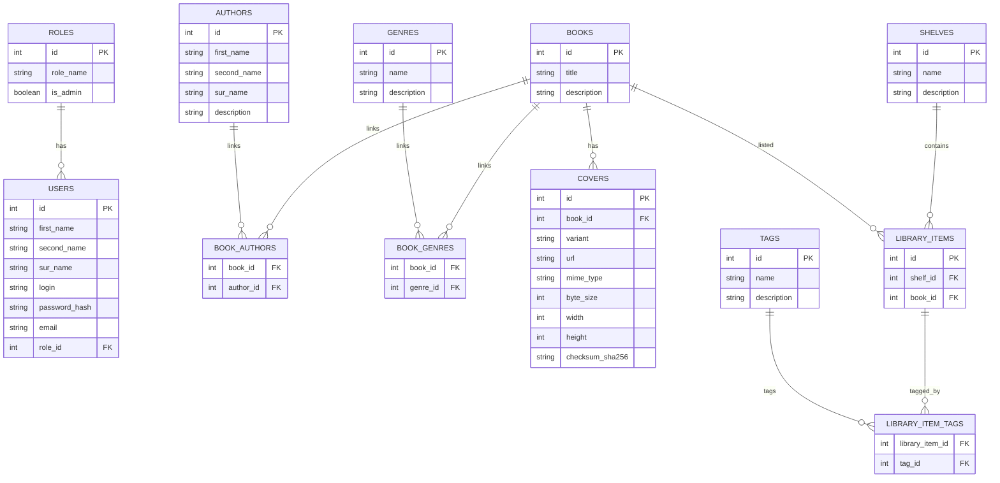

# Domain Model v0.1

Goal: a simple schema (no many-to-many yet) to quickly create tables and start building features.

## Conventions
- Naming: snake_case for fields.
- Passwords are never stored in plain form: `password_hash` only.
- `required/optional` marked explicitly.
- Foreign keys are marked as `FK -> table.column`.
- Table naming: plural (roles, users, books, ...).

---

## Roles / Users

### roles
- id (PK)
- role_name (required, unique)
- is_admin (required)

### users
- id (PK)
- first_name (required)
- second_name (optional)
- sur_name (optional)
- login (required, unique)
- password_hash (required)
- email (required, unique)
- role_id (required, FK -> roles.id)

Relations:
- roles 1 -> N users

---

## Books / Authors / Genres (v0.1)

### authors
- id (PK)
- first_name (required)
- second_name (optional)
- sur_name (optional)
- description (optional)

### genres
- id (PK)
- name (required, unique)
- description (optional)

### books
v0.1 assumes a single author and a single genre per book.
- id (PK)
- title (required)
- description (optional)
- author_id (optional, FK -> authors.id)
- genre_id  (optional, FK -> genres.id)

Relations (v0.1):
- authors 1 -> N books (books.author_id)
- genres  1 -> N books (books.genre_id)

---

## Covers (v0.1)
TBD in v0.1.

Direction decision:
- store cover as URL + metadata (not BLOB)

---

## Library / Shelves / Tags (v0.1)

### shelves
- id (PK)
- name (required, unique)
- description (optional)

### tags
- id (PK)
- name (required, unique)
- description (optional)

### library
A library record is: "book on shelf" + optionally a single tag.
- id (PK)
- shelf_id (required, FK -> shelves.id)
- book_id  (required, FK -> books.id)
- tag_id   (optional, FK -> tags.id)

Relations (v0.1):
- shelves 1 -> N library
- books   1 -> N library
- tags    1 -> N library (optional)

---

## Mermaid ERD (v0.1)

# Domain Model v0.2 (Target)

Goal: normalize the schema:
- many-to-many for Books <-> Authors and Books <-> Genres
- `library` becomes `library_items`
- tags via join table
- `covers` stored as URL + metadata

## Conventions
- Naming: snake_case.
- `password_hash` only.
- many-to-many uses join tables with composite PKs.
- Table naming: plural.

---

## Roles / Users

### roles
- id (PK)
- role_name (required, unique)
- is_admin (required)

### users
- id (PK)
- first_name (required)
- second_name (optional)
- sur_name (optional)
- login (required, unique)
- password_hash (required)
- email (required, unique)
- role_id (required, FK -> roles.id)

Relation:
- roles 1 -> N users

---

## Books / Authors / Genres

### authors
- id (PK)
- first_name (required)
- second_name (optional)
- sur_name (optional)
- description (optional)

### genres
- id (PK)
- name (required, unique)
- description (optional)

### books
- id (PK)
- title (required)
- description (optional)

### book_authors (Books <-> Authors)
- book_id (PK, FK -> books.id)
- author_id (PK, FK -> authors.id)

### book_genres (Books <-> Genres)
- book_id (PK, FK -> books.id)
- genre_id (PK, FK -> genres.id)

Relations:
- books M <-> N authors via book_authors
- books M <-> N genres  via book_genres

---

## Covers (URL + metadata)

### covers
- id (PK)
- book_id (required, FK -> books.id)
- variant (required; e.g. original/small/medium)
- url (required)
- mime_type (optional)
- byte_size (optional)
- width (optional)
- height (optional)
- checksum_sha256 (optional)
  Constraint:
- unique(book_id, variant)

Relation:
- books 1 -> N covers

---

## Library / Shelves / Tags

### shelves
- id (PK)
- name (required, unique)
- description (optional)

### tags
- id (PK)
- name (required, unique)
- description (optional)

### library_items
A library item is: "book on shelf".
- id (PK)
- shelf_id (required, FK -> shelves.id)
- book_id  (required, FK -> books.id)
  Constraint:
- unique(shelf_id, book_id)

### library_item_tags (LibraryItems <-> Tags)
- library_item_id (PK, FK -> library_items.id)
- tag_id (PK, FK -> tags.id)

Relations:
- shelves 1 -> N library_items
- books   1 -> N library_items
- library_items M <-> N tags via library_item_tags

---

## Mermaid ERD (v0.2)

